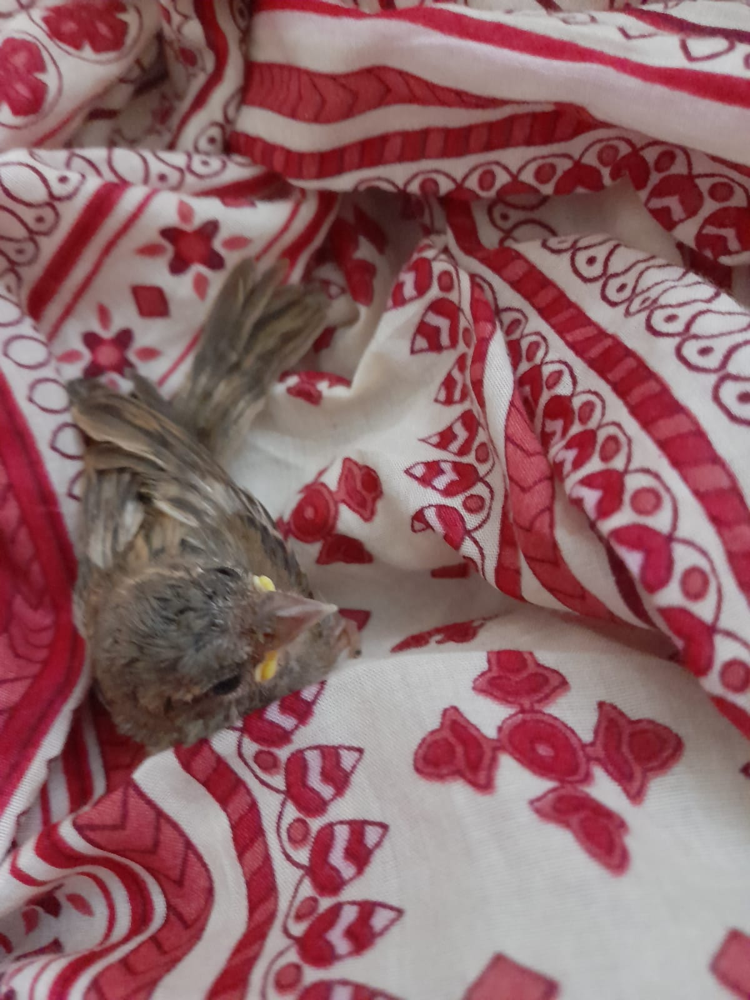
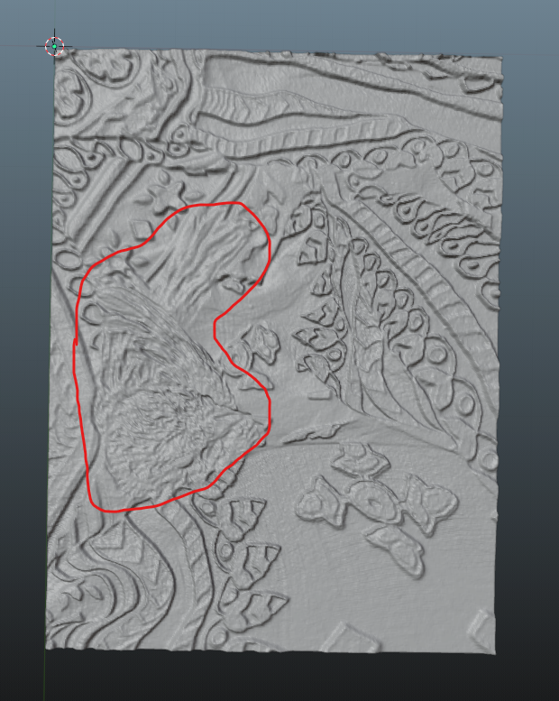

# Convert 2D images into 3D model(.stl) using Python

This Python code converts basic 2D images into flat 3D (without creating much depth)

# Tech Stack used in this

1. Python
2. Nump-stl
3. Blender

1. First the original image

2. 3D generated model

As you can see that the object in red highlight is a bird in 3D plane

# Explanation of Code

This code converts an image to a 3D surface and saves it as an STL file. STL (Stereolithography) files describe the surface geometry of a 3D object without any representation of color or texture.

The approach is based on creating a 3D surface where the height (z-coordinate) of each point is determined by the intensity of the corresponding pixel in the image. Lighter pixels represent higher areas, while darker pixels represent lower areas. This is commonly used in 3D printing, where grayscale images can be converted to 3D relief models.

Here's a more detailed step-by-step explanation of the process:

1. The script starts by loading the image file and converting it to grayscale. The conversion simplifies the image information, since grayscale images only contain intensity information and no color data.

2. The image is resized to a maximum size of `500x500` pixels. This is done to manage computational complexity. A larger image would result in a more complex 3D model, requiring more time and resources to process.

3. The numpy array `imageNp` is created to represent the pixel intensities of the grayscale image.

4. The maximum and minimum pixel intensities (`maxPix` and `minPix`) are calculated.

5. A 3D numpy array `vertices` is created to store the (x, y, z) coordinates of each vertex in the 3D model. The x and y coordinates correspond to the pixel's location in the image, and the z coordinate (height) is calculated by scaling the pixel intensity to the range of `[min_height, max_height]`.

6. Faces of the 3D mesh model are created. A face is a triangle described by three points (vertices) the choice of triangle is because GPU's are better performant on triangles. For each pixel (excluding the last row and column), two triangular faces are defined using that pixel and its right and bottom neighbors. This forms a small square part of the 3D surface.

7. An empty Mesh object is created with the numpy-stl library. This object has the same number of faces as the `facesNp` array.

8. The vertices of each face in the Mesh object are set to the corresponding vertices from the `facesNp` array.

9. The 3D model is saved to an STL file named `chiri.stl`.

This script assumes that the grayscale image represents a topographic map, where pixel intensity is equivalent to height. As a result, the output STL file represents the 3D topography of the image.
